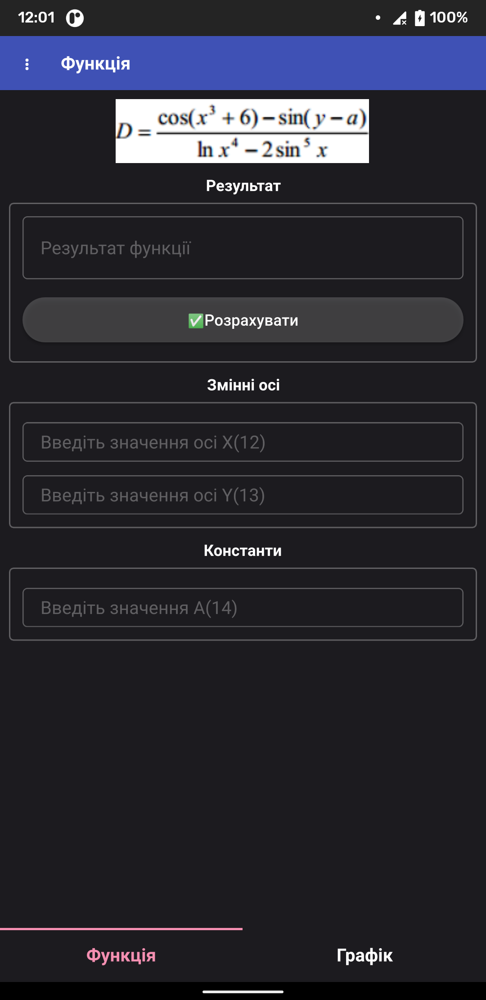
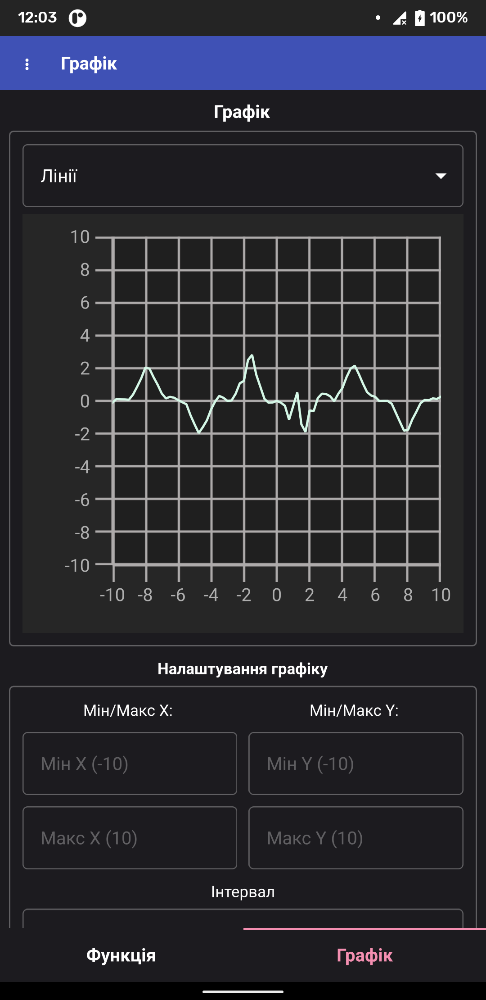
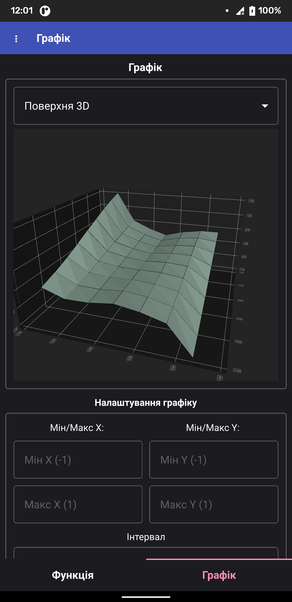
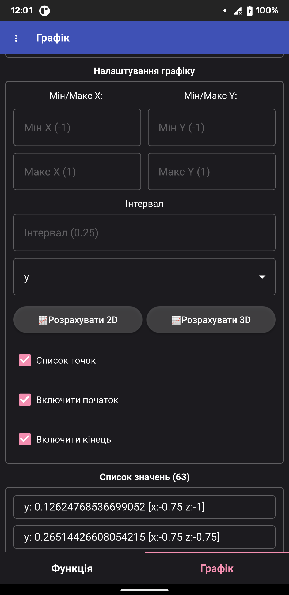
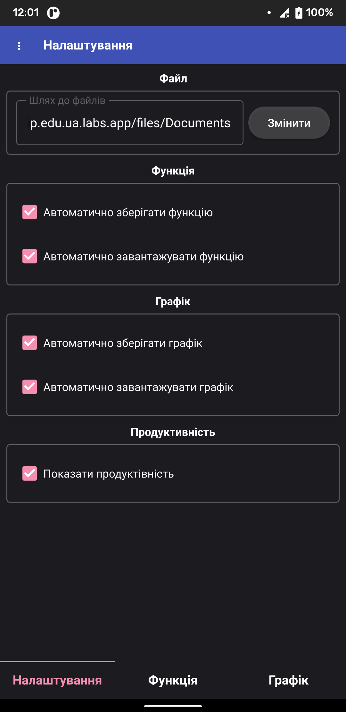
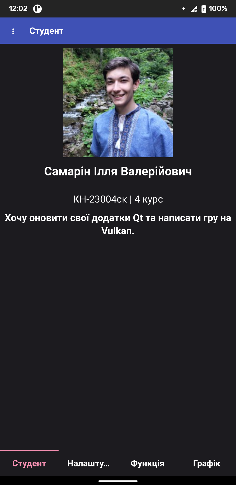

# Лабораторна робота №1-4

> Мета №1: Опанувати основи роботи з середовищем програмування для мобільних пристроїв, створити першу просту програму. 

> Мета №2: Навчитись застосувати знання і уміння обчислювати складні вирази з курсу програмування при програмуванні мобільних застосунків. 

> Мета №3: Засвоїти технологію роботи з локальними файлами для мобільних застосунків. 

> Мета №4: Навчитись використовувати АРІ двомірної графіки для візуалізації даних у мобільних застосунках.

## Збирання проєкту

- **CMake 3.15**
- **Qt6.5 або вище**
- **AndroidSDK**

# Скріншоти

## Сторінка: Функція

## Сторінка: Графік

## Сторінка: Налаштування

## Сторінка: Профіль розробника

